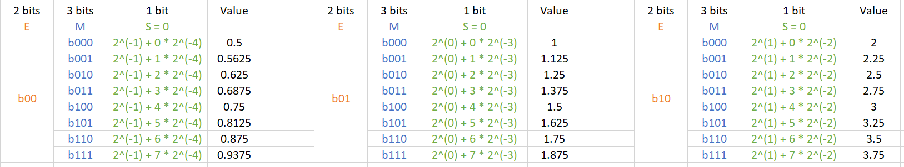
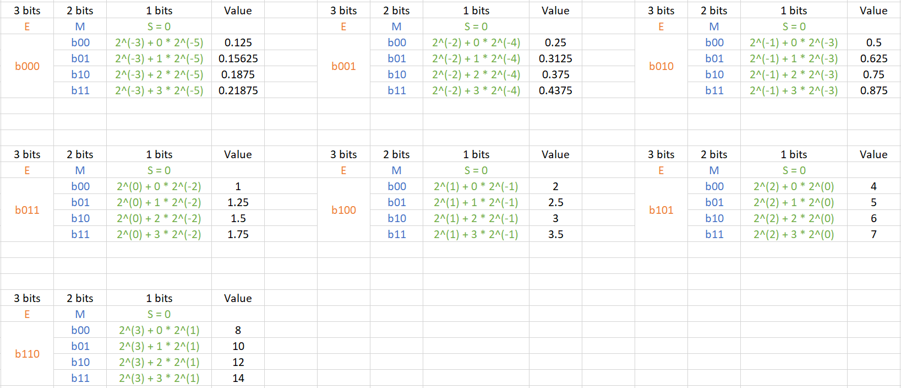
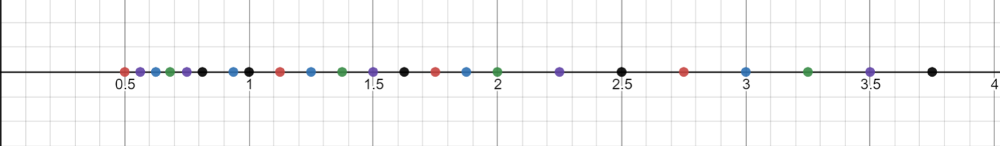

1. Draw the equivalent of Fig 6.5 for a 6-bit format (1-biy sign, 3-bit mantissa, 2-bit 
exponent). Use your result to explain what each additional mantissa bit does to the set
of representable numbers of the number line.

   * __Answer:__

       

    
      The above figure shows how I calculate all representable numbers by using given format. The exponent value, E = b11 is reserved. There are 24 numbers in total evenly distributing in 3 intervals: [0.5, 0.9375], [1, 1.975], [2, 3.75]. 
    
      The figure below is the visualization of those numbers in 1-D plot. The mantissa bit determines the precision of the representation in a given interval. 1 additional mantissa bit will increase the precision by 2 times.  
         
   

2. Draw the equivalent of Fig 6.5 for a 6-bit format (1-biy sign, 2-bit mantissa, 3-bit 
exponent). Use your result to explain what each additional exponent bit does to the set
of representable numbers of the number line.

   * __Answer:__
     
     

     
     The above figure shows how I calculate all representable numbers by using given format. The
    exponent value, E = b111 is reserved. There are 28 numbers in total evenly distribuing in 7 
    intervals: [0.125, 0.21875], [0.25, 0.4375], [0.5, 0.875], [1, 1.75], [2, 3.5], [4, 7], [8, 14].

  The figure below is the vlsualization of those numbers in 1-D plot. The exponent bit determines the range of representable numbers. Compared with the format in problem 1, the given format can represent numbers in a 4 times bigger range.
    
   

      

3. Assume that in a new processor design, due to technical difficulty, the floating-point
arithmetic unit that performs addition ca only do "round to zero" (rounding by truncating
the value toward 0). The hardware maintains sufficient number of bits that the only error
introduced is due to rounding. What is the maximul ulp error value for add operation on 
this device?

   * __Answer:__ 

      It depends on number of mantissa bits. Since he arithmetic unit can only do 'round to 
   zero', the final sum will not hold any digits after the decimal points. Suppose we have
   n mantissa bits. The prescison will be 1.0B*2^(-n), and the maximal ult will be 1.0B / (1.0B * 2^(-n))D ulp. The final MAX ulp error is (2^n)D ulp.

4. A graudate student wrote a CUDA kernel to reduce a large floating-point array to the
sum of all its elements. The array will always be sorted with the smallest values to the 
largest values. To avoid brach divergence, he decided to implement algorithm of Fig. 5.15.
Explain why this can reduce the accurancy of his results.

   * __Answer:__

     The algorithm used here refers to the improved sum-reduction algorithm. In this algoritm,
    the second half of elements will be added to the first half to reduce potential branch 
    divergence. In this problem, larger number will be added to smaller numbers by his kernel.
    It is a classic case mentioned in section 6.5.

5. Assume that in an arithmetic unit design. the hardware implements an iterative approximation 
algorithm that generates two additional accurate mantissa bits of the result for the sin()
function in each clock cycle. The architect decided to allow the arithmetic function to iterate
9 clock cycles. Assume that the hardware fills in all remaining mantissa bits as 0's. What
would be the maximal ulp error of the hardware implementation of the sin() function in this
design of the IEEE single-precision numbers? Assume that the omitted '1.' mantissa bit must
also be generated by the arithmetic unit. 

   * __Answer:__

       According to this question, 9 iterations will generate only 18 bits. The single-precision floating numbers have 23 mantissa bits, and then the last 5 bits will not have any value. Comparing with the accuratest result of sin() in single-precision floating number, the max ULP will be (2^5)D ULP.
